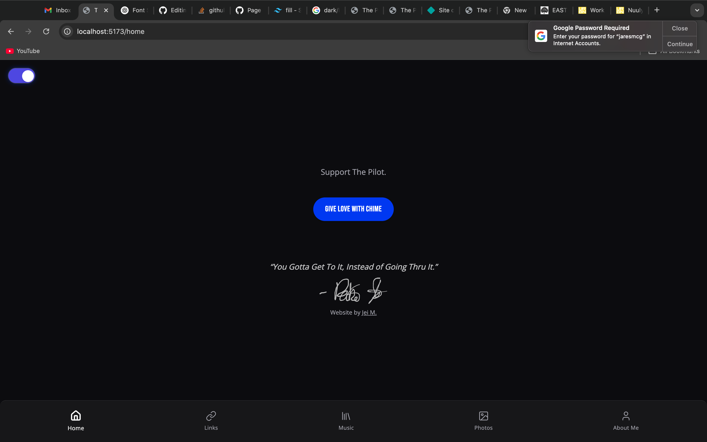
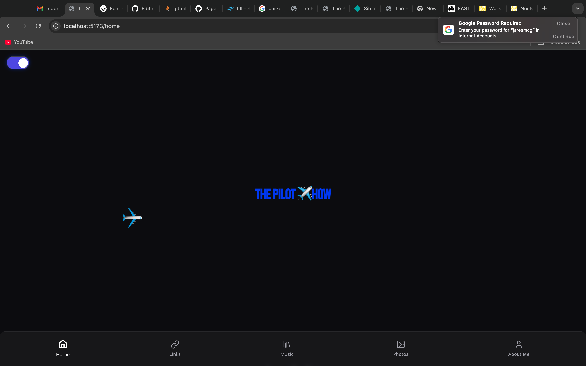

# ✈️ The Pilot Show — Portfolio Project

**Live Site:** [pilotszn.netlify.app](https://pilotszn.netlify.app)

A cinematic, mobile-first portfolio built for an artist known as *PilotBoyD*.  
This site is themed around flight, mystery, and momentum — blending bold visuals with smooth UX, Firebase integration, and animated interactions.

---

## 🌟 Features

### 🎨 Theming & UI
- **Dark/Light Mode Toggle** (persistent via localStorage)
- **Animated flyby plane** that loops across the screen
- **Signature aura buttons** with radial pulse effects
- **Responsive layout** across devices
- **Typography pairing:** Bebas Neue for headings, Open Sans for body

### 🔁 Animations
- Plane loop powered by pure CSS (`@keyframes flyLoop`)
- Hover effects, button transitions, and page fade-ins
- Custom utility classes via Tailwind layers

### 🔐 CMS Integration
- **Firebase Firestore** used for managing photo and video content
- **Firebase Auth** allows secure login to a custom media dashboard
- **Toast notifications**, pagination, and caching for smoother UX

### 📸 Dynamic Content
- Upload + display photos and videos
- Modal preview on click
- Tag-based filtering for future expansion

---

## 🛠 Tech Stack

- **Frontend:** React + Vite
- **Styling:** Tailwind CSS, custom utility layers
- **State:** React hooks + localStorage
- **Backend / CMS:** Firebase Firestore + Auth
- **Deployment:** Netlify

---

## 📂 File Highlights

| File / Folder         | Purpose                                   |
|----------------------|-------------------------------------------|
| `/src/components/`   | Reusable UI components (Header, Toggle, etc.) |
| `DarkLightToggle.jsx`| Full context + animated dark/light switch |
| `plane.css`           | Looping flyby animation for the plane ✈️ |
| `utilities.css`       | Custom Tailwind-based utility classes     |
| `Photos.jsx`          | Paginated media gallery with Firestore    |
| `firebase.js`         | Firebase config + Firestore instance      |

---

## 🚀 Setup Instructions

1. **Clone repo:**
   ```bash
   git clone https://github.com/jeimcg/thepilotshow-site.git
   cd thepilotshow-site
2. **Install dependencies:**
   ```bash
   npm install
3. **Connect Firebase**
   Create a .env or configure your firebase.js with your project keys
4. **Run the dev server**
   ```bash
   npm run dev
5. **Deploy to Netlify**
   Just connect your GitHub repo, set the build command to npm run build, and publish the /dist folder.

   
   
